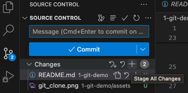
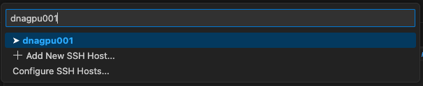

# geocomputing coffee - 26 Oct. 2023
Git and GitHub basics and interactive remote computing on curnagl's GPU node sing VS Code and the Julia and Remote-SSh extensions.

## Topics covered
- Git basics: repo creation, clone, pull, stage, push
- VS Code and Julia, Git, Remote-SSH extensions
- Julia programming: juliaup, CUDA, benchmarking

## Software installation and setup
To get started, install following software:
- VS Code (free editor): https://code.visualstudio.com
- [Julia](https://julialang.org) (open source): [juliaup (preferred)](https://github.com/JuliaLang/juliaup) ([direct download](https://julialang.org/downloads/))
- VS Code extensions: [Julia extension](https://code.visualstudio.com/docs/languages/julia#_getting-started) | [Remote-SSH extension](https://code.visualstudio.com/blogs/2019/07/25/remote-ssh#_connect-using-remote-ssh)

Then, create a GitHub account at https://github.com (if you do not have one yet).

We are going to access [Unil's Curnagl cluster](https://wiki.unil.ch/ci/books/high-performance-computing-hpc/page/curnagl); make sure to have an account and access to the machine.

> :bulb: Note that outside of Unil you will need a VPN to perform the following tasks.

We will need a password-less ssh to facilitate the connexion to Curnagl from within VS Code. See [Connexion with a key](https://wiki.unil.ch/ci/books/high-performance-computing-hpc/page/ssh-connection-to-dcsr-cluster) documentation to set this up.

## Creating a git repository
On [GitHub](www.github.com), create a new repository giving it a meaningful name. I named mine [`git-demo`](https://github.com/Unil-SGC/git-demo).

Make sure to add a `README` and select a licence (suggesting MIT).

Once you're done, clone the repository using either `HTTPS` or `SSH`; copy the provided link.


On your local computer, navigate to a folder you want to clone the repository into, and type
```
git clone XYZ.git
```
replacing `XYZ.git` with the content you copied from GitHub.

Open VS Code and open the folder of your git repository you just cloned.


Add a `scripts` folder in which you can add the memcopy `bench.jl` Julia script from [here](https://gist.github.com/luraess/7e7410ac4113b9fe9bb951510d0baf76).

Add also a `.gitignore` file at the root of the repository to define the resources that should not be tracked by git:
```
.DS_Store
.vscode
Manifest.toml
```

Then in the "Source Control" panel (on the left in VS Code), click the `+` next to "Changes" to stage recent modifications.



Add a meaningful commit message, press "Commit" and "Sync" (or "push" from the `⋅⋅⋅` icon next to "Source Control"). That's it, head to [GitHub](www.github.com) to check that your addition are now pushed to the remote.

## Run the Julia script locally
You can locally run the `bench.jl` script. To do so, launch Julia by typing `Julia: Start REPL` in the command panel from VS Code. Alternatively, you can hit `ctrl + j` followed by `o` to launch Julia.

> :bulb: You can access the command panel upon typing `cmd + shift + p` on macOS, and `ctrl + shift + p` on Windows.

Then, to run the code, you can:
- type `Julia: Execute file in REPL` from the command panel
- hit the "play" button in the upper right panel
- type `include("bench.jl")` in the REPL

The code copied from [here](https://gist.github.com/luraess/7e7410ac4113b9fe9bb951510d0baf76) should run fine on your CPU.

Now, we want to try out GPU computing. We may not have a GPU on the local machine, but Curnagl has Nvidia A100 GPUs.

## Remote connexion to Curnagl
We can use VS Code to remotely connect to a GPU compute node on Curnagl via ssh using the [Remote-SSH extension](https://code.visualstudio.com/blogs/2019/07/25/remote-ssh#_connect-using-remote-ssh) of VS Code.

First, we need to add Curnagl as remote server in our "SSH Config File". Select the "Remote Explorer" panel on the left side of VS Code. Then, click on the wheel in the upper left corner next to the SSH text


Select the first file proposed (`.ssh/config`) and add to it following replacing `<username>` by your username on Curnagl
```
Host curnagl
  HostName curnagl.dcsr.unil.ch
  User <username>
  IdentityFile ~/.ssh/id_ed25519
```

You can also add the following entry to the SSH Config File that will allow for running VS Code and Julia directly on an interactive compute node on Curnagl
```
Host dnagpu*
  HostName %h
  User <username>
  IdentityFile ~/.ssh/id_ed25519
  ProxyJump curnagl
  ForwardAgent yes
  RequestTTY yes
```

Now, we should see the Curnagl entry in the "REMOTES"


## Installing Julia locally on Curnagl
Then, on Curnagl, we can start a terminal within VS Code (`cmd + j` on macOS, `ctrl + j` on Windows) and install Julia locally. The simplest is to repeat the procedure using [juliaup](https://github.com/JuliaLang/juliaup).

Make also sure that the useful local VS Code extensions (Julia) are also installed on Curnagl.

To verify, try launching Julia from within VS Code on Curnagl (now on the login node). If it works, you are all set.

## Cloning a git repo
Then, we want to clone a git repository on Curnagl. We can achieve this as on our local machine using `git clone XYZ.git`. However, we need to work on the `/scratch` partition of Curnagl (and not in the `/home`). To do so, proceed as following (replacing `<username>` by your username on Curnagl)
```
[<username>@dnagpu001 ~]$ pwd
/users/<username>
[<username>@dnagpu001 ~]$ ln -s /scratch/<username> scratch
[<username>@dnagpu001 ~]$ ll
total 1
lrwxrwxrwx 1 <username> unil 15 Aug 21 14:59 scratch -> /scratch/<username>
```

Then, `cd scratch` to change directory and clone the [git-demo](https://github.com/Unil-SGC/git-demo) repository [https://github.com/Unil-SGC/git-demo](https://github.com/Unil-SGC/git-demo) which contains the GPU-ready addition of the memory copy benchmark [bench.jl](https://github.com/Unil-SGC/git-demo/blob/main/scripts/bench.jl) and the GPU-only version [bench_gpu.jl](https://github.com/Unil-SGC/git-demo/blob/main/scripts/bench_gpu.jl)
```
git clone https://github.com/Unil-SGC/git-demo.git
```

## Running interactively on Curnagl
From the terminal within VS Code on Curnagl, request an interactive session with one GPU and 8 CPU cores
```
[<username>@curnagl ~]$ Sinteractive -G 1 -c 8

Sinteractive is running with the following options:

--gres=gpu:1 -c 8 --mem 8G -J interactive -p interactive -t 1:00:00

salloc: Granted job allocation 34713678
salloc: Waiting for resource configuration
salloc: Nodes dnagpu001 are ready for job
[<username>@dnagpu001 ~]$
```

We see that we are now on node `dnagpu001`. From here, we can see we have access to a GPU upon typing `nvidia-smi` command (here showing truncated output)
```
[<username>@dnagpu001 ~]$ nvidia-smi
Fri Oct 27 11:23:02 2023
+-----------------------------------------------------------------------------+
| NVIDIA-SMI 510.47.03    Driver Version: 510.47.03    CUDA Version: 11.6     |
|-------------------------------+----------------------+----------------------+
| GPU  Name        Persistence-M| Bus-Id        Disp.A | Volatile Uncorr. ECC |
| Fan  Temp  Perf  Pwr:Usage/Cap|         Memory-Usage | GPU-Util  Compute M. |
|                               |                      |               MIG M. |
|===============================+======================+======================|
|   0  NVIDIA A100-PCI...  On   | 00000000:21:00.0 Off |                   On |
| N/A   28C    P0    32W / 250W |     38MiB / 40960MiB |     N/A      Default |
|                               |                      |              Enabled |
+-------------------------------+----------------------+----------------------+
|   1  NVIDIA A100-PCI...  On   | 00000000:E2:00.0 Off |                   On |
| N/A   27C    P0    34W / 250W |     38MiB / 40960MiB |     N/A      Default |
|                               |                      |              Enabled |
+-------------------------------+----------------------+----------------------+
```

At this point, we could already run code on the GPU. However, VS Code and Julia is not yet running on the `dnagpu001` node, only the terminal is there. If we want to hook VS Code and then launch Julia interactively on `dnagpu001` node, we need to open the command panel in VS Code (`cmd + shift + p` on macOS, and `ctrl + shift + p` on Windows) and type `Remote-SSH: Connect to Host...`



Upon hitting "enter", you should see a new VS Code instance opening: now you're hooked into the GPU node :rocket:

First, open the folder you previously cloned `scratch/git-demo` within VS Code. Then, you can launch again the Julia REPL (`cmd + j + o` on macOS, `ctrl + j + o` on Windows) and try plotting an array of random numbers initialised on the GPU the verify that interactive plotting and GPU access is working.
```julia-repl
pkg > activate .

pkg > instantiate
```

Then, following commands should work
```julia-repl
julia> using CUDA, Plots

julia> CUDA.devices()

julia> A_h = rand(3, 4)

julia> A_d = CuArray(A_h)

julia> heatmap(Array(A_d)')
```
If all went fine, you should see a plot pane popping-up in VS Code.

The final step is to run the `bench_gpu.jl` code and verify the memory copy throughput of the Nvidia A100 GPU.

> :bulb: Obviously many things may possibly go wrong in setting this up. If you hit any issue, just reach out.
